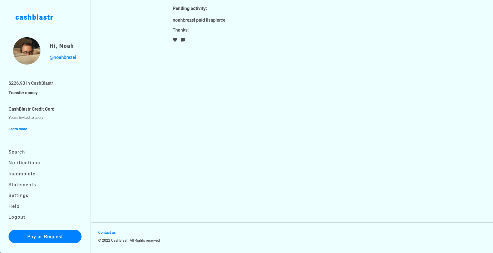

# CashBlastr
### This is a clone of Venmo for a similar ficticious business named CashBlastr. The goal is to show the layout a user would see when logged in, and utilize the Braze SDK to simulate personalized messaging.

---
#### * App screenshot: 

####  

---

## Technologies 
#### * HTML, CSS, SASS, JavaScript

#### I created a Venmo account a while back but have never used it (my wife tends to settle payments with friends) so when I logged into my account, I didn't have an activity feed. Thus it seemed like a straightforward build so I made the site using HTML, CSS & JS. If I had known there were components that would be reused, I probably would have used React. I have a Sass Live Compiler extension in my VS Code, so that is how the CSS files are generated from the SCSS files I work with. 

---

## Future development:
#### Getting the activity feed laid out better (not finished with styling) as well as getting the Braze SDK to work. Despite trying multiple ways to import it, I was never successful.
